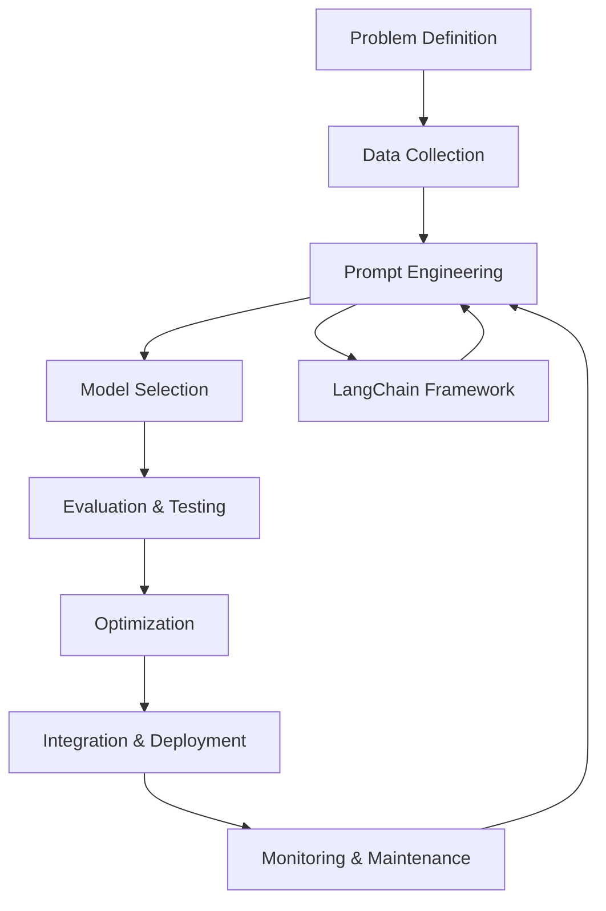

# GenAI/LLM Workflow Integration - LangChain Framework

This document explains how the LangChain-based Prompt Engineering Framework fits into the broader GenAI and LLM development workflow, from experimentation to production deployment.

## Overview: The GenAI Development Lifecycle



## Framework Position in the Workflow

### 1. **Prompt Engineering Phase** (Primary Focus)
This LangChain-based framework serves as the **central hub** for the prompt engineering phase, providing:

- **LangChain Template Management**: Store and version control prompts using LangChain's PromptTemplate
- **Rapid Prototyping**: Quick iteration on prompt variations with LangChain chains
- **Systematic Testing**: Evaluate prompt performance using LangChain's evaluation framework
- **Optimization**: Automated prompt improvement with LangChain components

## Workflow Integration Examples

### 1. **RAG (Retrieval-Augmented Generation) Pipeline**

```python
# Example: RAG system integration with LangChain
from src.langchain_core import LangChainPromptManager, UnifiedLLMProvider
from langchain.chains import RetrievalQA
from langchain.vectorstores import Chroma

class LangChainRAGSystem:
    def __init__(self):
        self.prompt_manager = LangChainPromptManager()
        self.llm_provider = UnifiedLLMProvider()
        
        # Load RAG-specific LangChain templates
        self.prompt_manager.register_template("rag_query", {
            "template": """Context: {context}
            
            Question: {question}
            
            Answer based on the context above:""",
            "input_variables": ["context", "question"]
        })
    
    def setup_rag_chain(self, vectorstore):
        """Setup LangChain RAG chain"""
        template = self.prompt_manager.get_template("rag_query")
        llm = self.llm_provider.get_model("gpt-4")
        
        return RetrievalQA.from_chain_type(
            llm=llm,
            chain_type="stuff",
            retriever=vectorstore.as_retriever(),
            chain_type_kwargs={"prompt": template}
        )
```

### 2. **LangChain Agent Integration**

```python
# Example: LangChain agents with custom prompt templates
from langchain.agents import initialize_agent, Tool
from langchain.agents import AgentType

class LangChainAgentSystem:
    def __init__(self):
        self.prompt_manager = LangChainPromptManager()
        self.llm_provider = UnifiedLLMProvider()
        
        # Define agent-specific templates
        self.prompt_manager.register_template("agent_planner", {
            "template": """You are a planning agent. Given the following tools:
            {tools}
            
            Break down this task: {task}
            
            Plan:""",
            "input_variables": ["tools", "task"]
        })
    
    def create_agent_with_custom_prompt(self, tools):
        """Create LangChain agent with custom prompt"""
        llm = self.llm_provider.get_model("gpt-4")
        
        return initialize_agent(
            tools=tools,
            llm=llm,
            agent=AgentType.ZERO_SHOT_REACT_DESCRIPTION,
            verbose=True
        )
```

### 3. **LangChain Chain Composition**

```python
# Example: Complex chain composition
from langchain.chains import SequentialChain, LLMChain

class LangChainPipelineSystem:
    def __init__(self):
        self.prompt_manager = LangChainPromptManager()
        self.llm_provider = UnifiedLLMProvider()
        
    def create_analysis_pipeline(self):
        """Create multi-step analysis pipeline"""
        llm = self.llm_provider.get_model("gpt-4")
        
        # Register pipeline templates
        self.prompt_manager.register_template("analyze", {
            "template": "Analyze this text: {text}\nAnalysis:",
            "input_variables": ["text"]
        })
        
        self.prompt_manager.register_template("summarize", {
            "template": "Summarize this analysis: {analysis}\nSummary:",
            "input_variables": ["analysis"]
        })
        
        # Create chains
        analysis_chain = LLMChain(
            llm=llm,
            prompt=self.prompt_manager.get_template("analyze"),
            output_key="analysis"
        )
        
        summary_chain = LLMChain(
            llm=llm,
            prompt=self.prompt_manager.get_template("summarize"),
            output_key="summary"
        )
        
        return SequentialChain(
            chains=[analysis_chain, summary_chain],
            input_variables=["text"],
            output_variables=["analysis", "summary"]
        )
```

## Integration with LangChain Ecosystem

### 1. **LangChain Memory Integration**
```python
from langchain.memory import ConversationBufferMemory
from langchain.chains import ConversationChain

class LangChainMemorySystem:
    def __init__(self):
        self.prompt_manager = LangChainPromptManager()
        self.llm_provider = UnifiedLLMProvider()
        
    def create_conversation_chain(self):
        """Create conversation chain with memory"""
        llm = self.llm_provider.get_model("gpt-3.5-turbo")
        memory = ConversationBufferMemory()
        
        # Custom conversation template
        self.prompt_manager.register_template("conversation", {
            "template": """The following is a friendly conversation between a human and an AI.
            
            Current conversation:
            {history}
            Human: {input}
            AI:""",
            "input_variables": ["history", "input"]
        })
        
        return ConversationChain(
            llm=llm,
            memory=memory,
            prompt=self.prompt_manager.get_template("conversation")
        )
```

### 2. **LangChain Callbacks Integration**
```python
from langchain.callbacks.base import BaseCallbackHandler
from langchain.callbacks.manager import CallbackManager

class PromptMonitoringCallback(BaseCallbackHandler):
    """Custom callback for monitoring prompt usage"""
    
    def __init__(self, evaluator):
        self.evaluator = evaluator
    
    def on_chain_start(self, serialized, inputs, **kwargs):
        """Called when chain starts"""
        print(f"Chain started with inputs: {inputs}")
    
    def on_chain_end(self, outputs, **kwargs):
        """Called when chain ends"""
        # Evaluate chain output
        if "output" in outputs:
            score = self.evaluator.evaluate_response(
                "criteria", 
                "", 
                outputs["output"]
            )
            print(f"Chain output score: {score['score']}")

# Usage
callback_manager = CallbackManager([PromptMonitoringCallback(evaluator)])
llm = self.llm_provider.get_model("gpt-4", callback_manager=callback_manager)
```

## LangChain-Specific Production Patterns

### 1. **LangServe Integration**
```python
from langserve import add_routes
from fastapi import FastAPI
from src.langchain_core import LangChainPromptManager, UnifiedLLMProvider

app = FastAPI()
prompt_manager = LangChainPromptManager()
llm_provider = UnifiedLLMProvider()

# Create LangChain chain
template = prompt_manager.get_template("summarization")
llm = llm_provider.get_model("gpt-4")
chain = LLMChain(llm=llm, prompt=template)

# Add LangServe routes
add_routes(app, chain, path="/summarize")
```

### 2. **LangSmith Integration**
```python
import os
from langsmith import Client
from src.langchain_core import LangChainEvaluator

# Initialize LangSmith client
os.environ["LANGCHAIN_API_KEY"] = "your-api-key"
client = Client()

class LangSmithIntegration:
    def __init__(self):
        self.evaluator = LangChainEvaluator(llm)
        self.client = client
    
    def log_evaluation_to_langsmith(self, dataset_name, results):
        """Log evaluation results to LangSmith"""
        for result in results:
            self.client.create_run(
                name=f"evaluation_{dataset_name}",
                inputs={"input": result["input"]},
                outputs={"output": result["prediction"]},
                extra={"score": result["score"]}
            )
```

## Benefits of LangChain Integration

### 1. **Ecosystem Compatibility**
- Direct integration with LangChain's extensive ecosystem
- Access to LangChain's agents, chains, and tools
- Compatible with LangServe, LangSmith, and other LangChain services

### 2. **Standardized Interfaces**
- Use industry-standard LangChain interfaces
- Consistent with LangChain best practices
- Easy migration between different LangChain components

### 3. **Advanced Features**
- Built-in memory management
- Sophisticated chain composition
- Agent-based workflows
- Streaming and callback support

### 4. **Community Support**
- Active LangChain community
- Regular updates and improvements
- Extensive documentation and examples

This LangChain-based framework serves as a crucial component in the GenAI workflow, providing the foundation for systematic prompt engineering, evaluation, and optimization that leverages the full power of the LangChain ecosystem.
